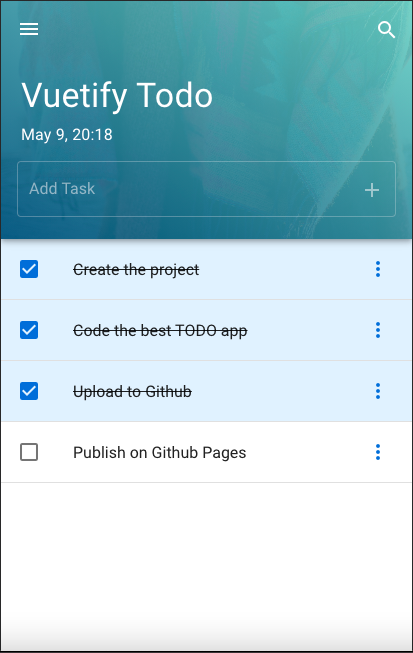

# vuetify-todo



## Project setup

Create a file called _.env.local_ with the following content

```
VUE_APP_TITLE=Vuetify Todo
```

Then run

```
yarn install
```

### Compiles and hot-reloads for development

```
yarn serve
```

### Compiles and minifies for production

```
yarn build
```

### Customize configuration

See [Configuration Reference](https://cli.vuejs.org/config/).
